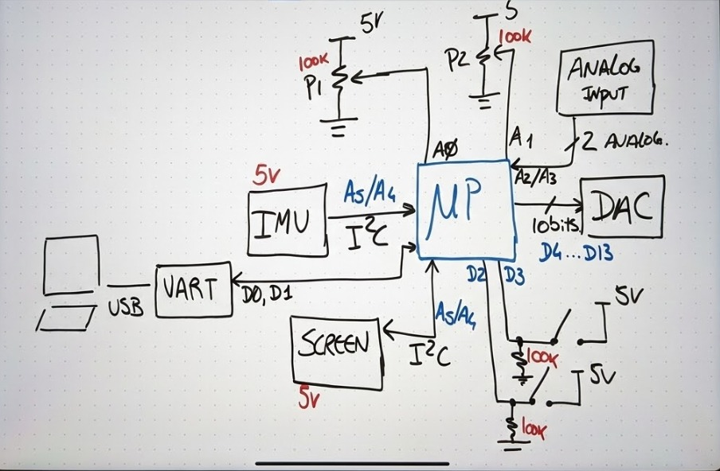
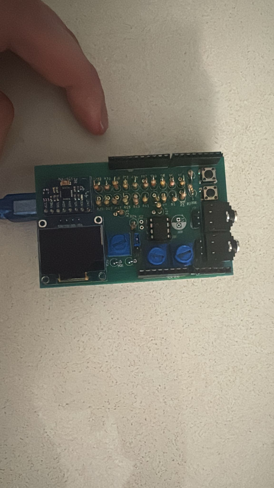
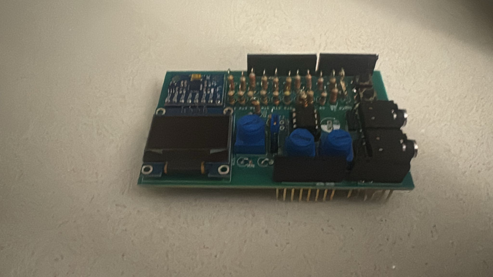
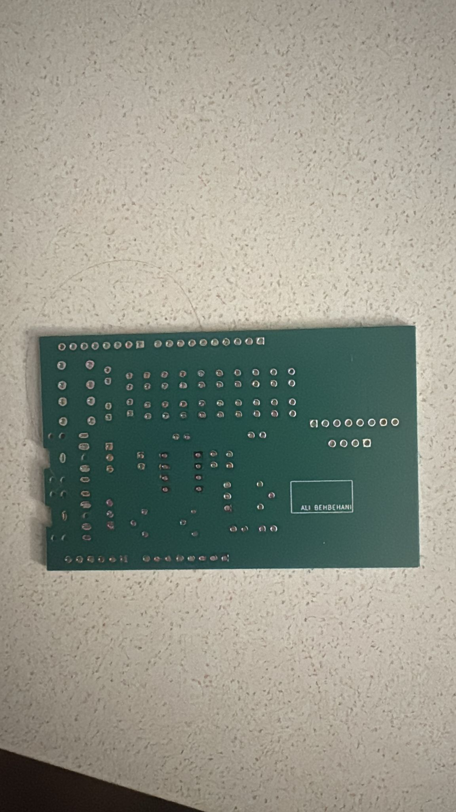

# uP DSP Shield for Microprocessor Applications

##  Introduction

This project presents the design and development of a custom Digital Signal Processing (DSP) Shield for microprocessor learning and experimentation. The shield is designed to help students understand embedded systems concepts such as analog-to-digital conversion (ADC), digital-to-analog conversion (DAC), serial communication protocols, interrupts, and real-time signal processing.

The system integrates sensors, user inputs, signal processing circuits, and display modules into a compact embedded platform that can be interfaced with a microcontroller board.

## Objectives

• Design a DSP shield compatible with microprocessor systems  
• Implement mixed-signal processing using ADC and DAC  
• Interface sensors using digital communication protocols  
• Display processed data on a screen  
• Provide hands-on experience in embedded systems design  

---
## System Specifications

• IMU Sensor Interface  
• OLED Display Module  
• 10-bit DAC Output  
• Push Button Inputs  
• Potentiometer-Based Analog Controls  
• External Analog Signal Inputs  
• UART Serial Communication  
• I2C Communication Protocol  

---

## 🧩 System Block Diagram

The block diagram represents the overall system architecture. The microprocessor acts as the central controller that receives input signals, processes data, and generates output signals.

Inputs are provided through analog sensors, potentiometers, and push buttons. Communication modules such as UART and I2C enable data exchange with peripheral devices. The processed signals are displayed on the OLED screen and can also be converted back to analog form using the DAC.

---
## Design Stage

During the design phase, the overall system architecture was planned by selecting the required components such as sensors, signal converters, communication modules, and user interface elements.

Circuit simulations and preliminary testing ensured compatibility between components. Special attention was given to signal integrity, stable power regulation, and modular circuit structure to ensure reliable performance.

---

## Prototype Stage

Before designing the PCB, the system was tested on a prototype board to validate the circuit operation.

Signal generation and processing were verified using development boards and discrete components. Analog waveforms were generated and tested to verify DAC performance. Sensor readings and communication interfaces were also validated.

---

## PCB Design

After successful prototype testing, the circuit schematic was converted into a professional PCB layout using electronic design software.

The design process included:

• Schematic capture  
• Component placement  
• Routing copper traces  
• Power and ground plane optimization  

The PCB layout was optimized to reduce electrical noise, improve signal flow, and maintain compact board size.

### PCB Layout – Top View

### PCB Layout – Bottom View

---

##  Assembly Stage

After PCB fabrication, electronic components were assembled onto the board using proper soldering techniques.

The following components were mounted:

• Integrated Circuits  
• Resistors and Capacitors  
• Connectors and Headers  
• Display Module  
• Input Buttons and Potentiometers  

All components were inspected carefully to ensure correct polarity and reliable electrical connections.

### Assembled Board

---

##  Testing Stage

The assembled DSP shield was tested to verify its functionality and performance.

Testing included:

• Power regulation verification  
• Analog signal acquisition  
• DAC waveform generation  
• Sensor data processing  
• Display output verification  
• UART and I2C communication testing  

All modules operated successfully under normal test conditions.

---

## Working Principle

The microprocessor acts as the brain of the system. It reads analog and digital inputs from sensors and user controls. The analog signals are converted into digital values using ADC for processing.

Based on programmed logic, the system processes the signals and generates digital outputs. These outputs are either displayed on the OLED screen or converted back into analog signals using the DAC.

Communication protocols such as UART and I2C allow the system to interact with external devices and modules efficiently.

---

## Major Hardware Components

• Microprocessor / Microcontroller Unit  
• IMU Sensor Module  
• OLED Display  
• R-2R Ladder DAC Circuit  
• Push Buttons  
• Potentiometers  
• Communication Interfaces  
• Power Regulation Circuit  

---
## Applications

• Embedded Systems Education  
• Digital Signal Processing Experiments  
• Sensor Data Acquisition Systems  
• Real-Time Monitoring Systems  
• Microprocessor Laboratory Training  

---

## Conclusion

The DSP Shield was successfully designed, fabricated, and tested for microprocessor-based signal processing applications. The project demonstrates practical implementation of embedded system concepts including mixed-signal processing, communication interfaces, and real-time monitoring.

This platform serves as an effective educational tool for students studying microprocessors and embedded systems.

---

## Author

**Student Name:** Ali Behbehani  
**Course:** ENCE 3100 – Microprocessors  
**Project:** DSP Shield Design  

---

## Project Images

---
